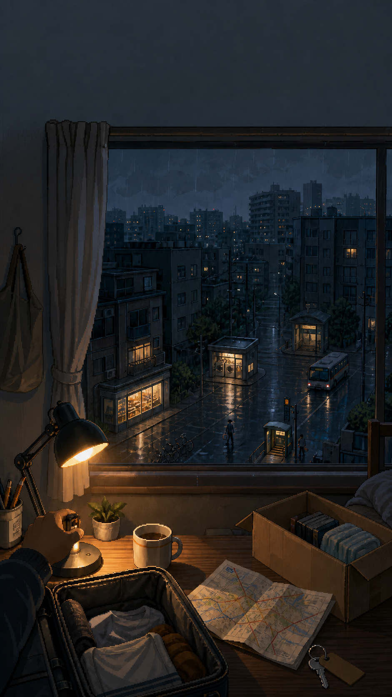
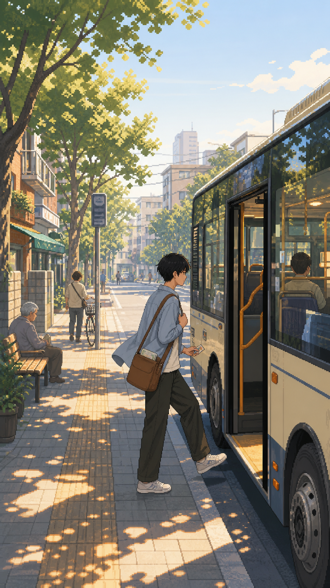
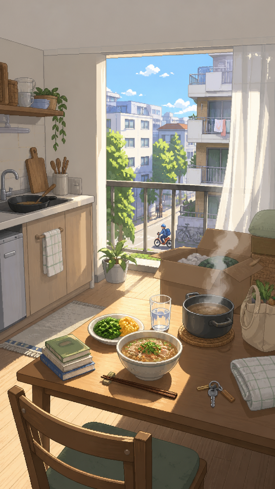

# Pixel Adventure Director

把现实经历、情绪和主题，转译成具有成熟像素美术、冒险隐喻与叙事空间的视觉场景。

**Pixel Adventure Director 是一位视觉导演，不是一层像素滤镜。** 你只需要简单告诉它大概的用途、主题和想要的感觉，它就会用一到两轮清晰的选项，集中确认尺寸、角色、叙事与风格等必要信息，然后快速生成有审美、有氛围、也有故事感的像素游戏风画面。它以温暖的冒险叙事为默认创作倾向，但冒险强度、现实程度、角色参与、画幅与整体气质都可以根据项目自由调整；首版若有偏差，再用一句话纠正即可。

它从真实状态出发，寻找一个能被看见、被进入，也能自然形成故事的场景：

```text
现实经验 → 核心状态 → 核心隐喻 → 场景母题 → 世界规则 → 角色行动 → 最终画面
```

适用于 H5、海报、社交传播、故事插画、Icon 和概念视觉。

## 案例：20 个字符以内

下面只列用户实际需要输入的内容；选择题和必要信息由 Pixel Adventure Director 主动组织。每个案例最多三次输入，全部输入合计不超过 20 个字符。

### 01｜开学成长


```text
开学成长
H5
冒险世界，单人
```

### 02｜第一次独自生活



```text
独自去陌生城市生活
AAAC
AA
```

### 03｜进入陌生城市



```text
换个带角色的场景
BC
要有氛围感
```

### 04｜独自生活的第一餐



```text
独自生活的第一餐
AA
白天，不要悬疑
```

## 提示词可以非常简单

你不需要先写完整的美术提示词。一句话就能开始：

```text
$pixel-adventure-director 我想做一张关于开学成长的像素画。
```

```text
$pixel-adventure-director 我想做一张关于第一次独自去陌生城市生活的图。
```

```text
$pixel-adventure-director 我想做一套服务于高考志愿填报的 H5 图。
```

```text
$pixel-adventure-director 做一个有氛围感的像素场景，带一个角色。
```

```text
$pixel-adventure-director 做一张真实、安静的大学宿舍夜景，不要奇幻元素。
```

Pixel Adventure Director 会把真正影响结果的信息集中成一轮选择题，复杂任务最多两轮。你可以直接回复：

```text
1A 2B 3A 4C
```

也可以在字母后补充自己的想法、项目背景或上传参考素材。

## 更多极简用法

### 指定用途或尺寸

```text
做一张手机 H5 开屏图，其他你判断。
```

```text
尺寸 1080 × 1920，顶部给标题留空间。
```

### 指定人物方式

```text
画面里增加一个新角色。
```

```text
只要环境路人，不承担剧情，也不用统一形象。
```

```text
不要人物，让空间自己讲故事。
```

```text
第二张继续使用刚才同一个人物。
```

当同一位叙事角色第二次进入新场景、但还没有正式设定板时，Skill 会先引导生成人物形象设定板，再继续画第二个场景，减少跨图变脸。

### 修改现有画面

```text
太游戏了，但角色和构图保留。
```

```text
画面太大，缺少故事感和代入感。
```

```text
去掉窗外的荧光线，其他不变。
```

```text
这个动作有逻辑问题，换一个白天场景。
```

Skill 会先判断问题属于细节、构图、角色、表达还是场景母题，再决定局部修改或重新生成。

## 一个稍完整的示例

如果你已经知道项目条件，也可以一次告诉它：

```text
$pixel-adventure-director
为手机 H5 做一张 1080 × 1920 的成熟像素画。
主题是第一次独自去陌生城市生活，白天，偏现实，只加入轻度冒险隐喻。
画面有一位现实青年型角色，顶部留标题安全区。
```

有项目背景文字、品牌设定、UI 线框、角色参考图或风格参考时，建议在第一次对话中一起提供；信息越完整，场景与项目的关系越准确。

## 它会做什么

- 根据 H5、海报、Icon 等真实用途调整画幅、信息密度、视觉焦点和安全区。
- 生成最终图像前确认一次尺寸；已提供精确尺寸时不重复询问。
- 区分叙事角色、环境路人和无人场景，避免所有人物都被强行赋予剧情。
- 新增叙事角色时完成一次人物风格引导，并维护必要的角色连续性。
- 选择表达主题所需的最低有效冒险强度，不自动堆叠传送门、宝箱、UI 或荧光特效。
- 优先建立一个清晰主隐喻、一个场景母题和可见的世界规则。
- 修改时保留已经成立的部分，不用无关细节掩盖概念问题。

## 安装

将本仓库克隆到你所使用、且具备图像生成能力的 Agent（例如 Codex）的个人 Skills 目录。不同 Agent 的目录位置可能不同，请将 `<YOUR_AGENT_SKILLS_DIR>` 替换为实际路径。

### macOS / Linux

```bash
git clone https://github.com/luyududu-bot/pixel-adventure-director.git "<YOUR_AGENT_SKILLS_DIR>/pixel-adventure-director"
```

### Windows PowerShell

```powershell
git clone https://github.com/luyududu-bot/pixel-adventure-director.git "<YOUR_AGENT_SKILLS_DIR>\pixel-adventure-director"
```

安装后，可以在新对话中显式调用：

```text
$pixel-adventure-director
```

调用后直接说出你的视觉需求即可。如果你使用的 Agent 支持根据描述自动发现 Skills，也可以直接描述需求，无需显式调用名称。

## 仓库结构

```text
pixel-adventure-director/
├── SKILL.md
├── README.md
├── agents/
│   └── openai.yaml
└── references/
    ├── interaction-system.md
    ├── adventure-system.md
    ├── character-system.md
    ├── scene-system.md
    ├── visual-language.md
    ├── generation-workflow.md
    └── qa-and-revision.md
```

- `SKILL.md`：执行入口、核心判断链和模块路由。
- `agents/openai.yaml`：可选的 Agent 界面元数据与默认调用方式。
- `references/`：交互、冒险化、人物、场景、视觉语言、生成与 QA 的详细规则。

## 设计边界

Pixel Adventure Director 适合“需要场景叙事与视觉转译”的像素创作，不适合：

- 只把现有图片转换成像素滤镜；
- 只需要像素化 Logo、字体或简单图标；
- 不需要场景、空间关系或叙事判断的普通图像处理。

它的目标不是让所有画面都更奇幻，而是让每一个视觉决定都服务于用户真实想表达的经验。

